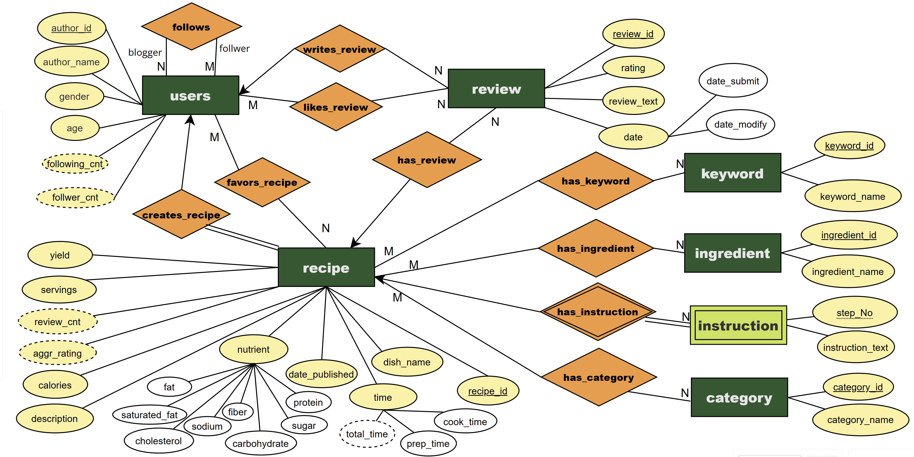
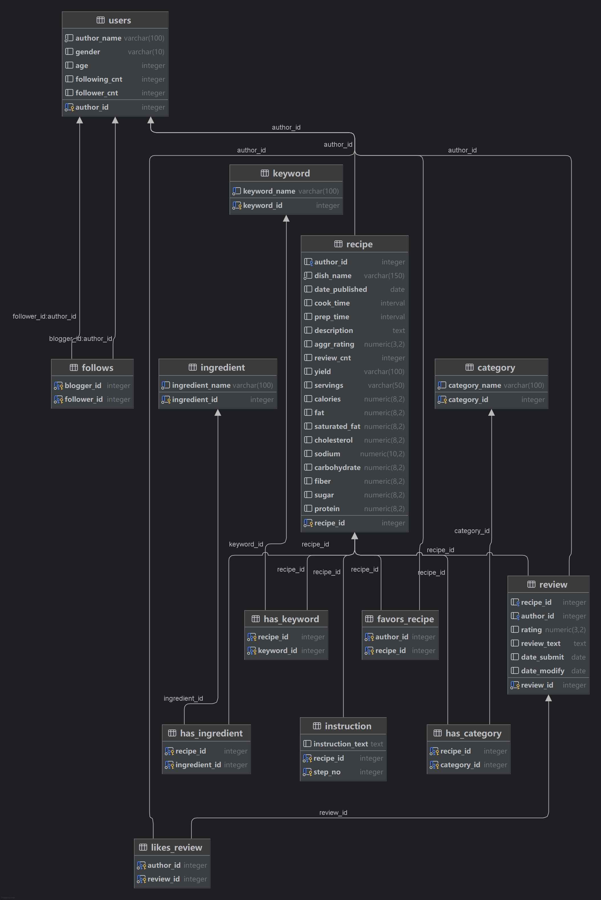
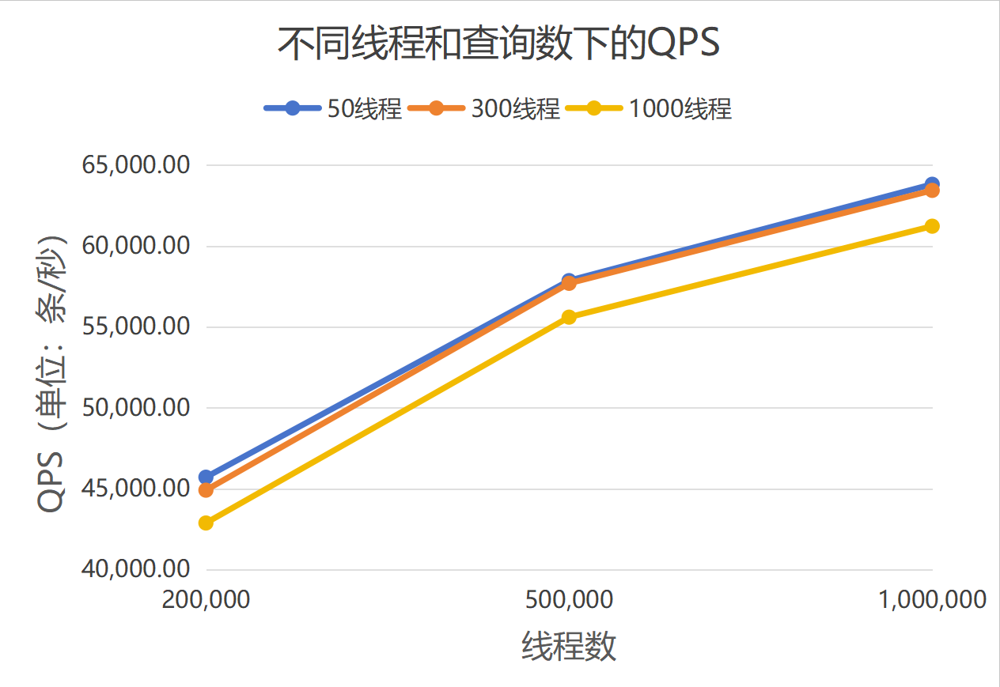
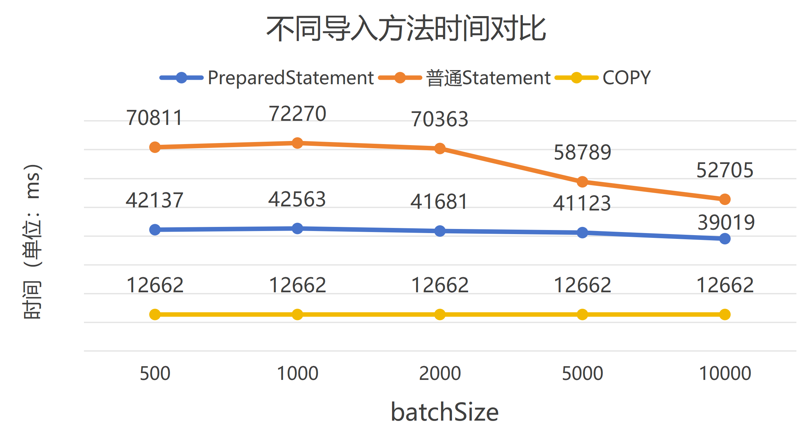
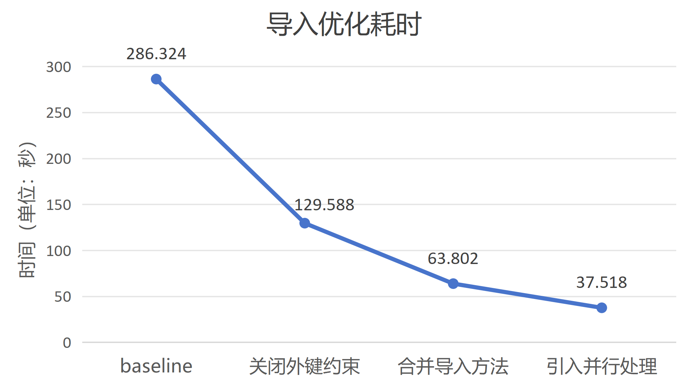
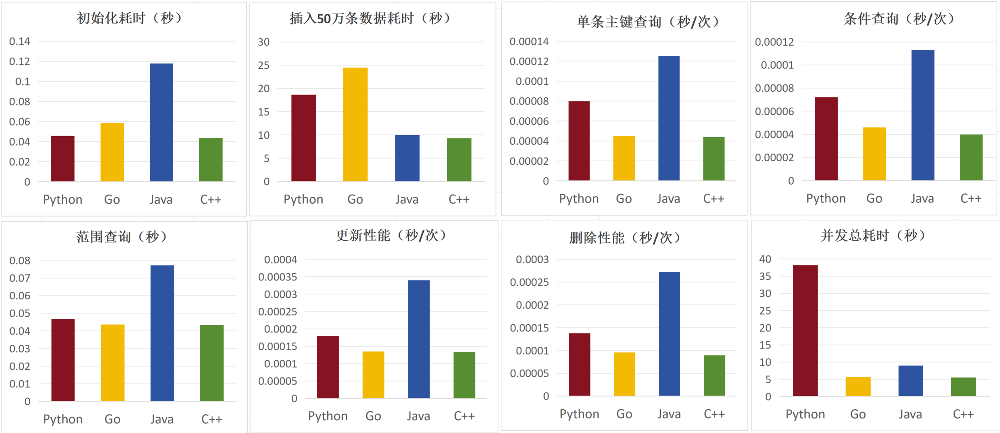

# SUSTech CS307 Project Part I — Report
## 目录
- [一、群组信息](#一-群组信息)
- [二、项目背景](#二-项目背景)
- [三、任务一：E-R图绘制](#三-任务一-e-r图绘制)
- [四、任务二：数据库设计](#四-任务二-数据库设计)
- [五、任务三：数据导入](#五-任务三-数据导入)
- [六、任务四：比较DBMS, File I/O, File Stream(任务四bonus)](#六任务四比较dbms-file-io-file-stream任务四bonus)
- [七、任务五：高并发查询处理（任务四 bonus）](#七-任务五-高并发查询处理-任务四-bonus)
- [八、任务六：导入方法对比与导入代码优化（任务三 bonus）](#八-任务六-导入方法对比与导入代码优化-任务三-bonus)
- [九、任务七：不同编程语言数据库性能对比（任务四 bonus）](#九-任务七-不同编程语言数据库性能对比-任务四-bonus)
- [十、总结](#十-总结)

---

## 一、群组信息
- **成员1**: 刘以煦 12410148
- **成员2**: 刘君昊 12410303
---

## 二、项目背景
- ### 项目介绍： 
根据课程提供的SUSTC食谱数据集设计标准数据库管理方式。完成数据库设计、数据快速导入、比较DBMS和文件I/O的性能及其他扩展内容。
- ### 原始文件：
  `recipes.csv`, `user.csv`, `reviews.csv`
---

## 三、任务一： E-R图绘制

- #### 绘图工具
https://online.visual-paradigm.com
- #### E-R 图

- #### 说明（详细建表说明将在任务二中指出）
  **strong entity set**: users, review, recipe, keyword, ingredient, category
  **weak entity set**: instruction
  **relationship**:
  - *follows*: followers follow bloggers (N to M)
  - *creates_recipe*: users create recipes (1 to N)
  - *favors_recipe*: users favor recipes (N to M)
  - *likes_review*: users like reviews (N to M)
  - *writes_review*: users write reviews (1 to N)
  - *has_review*: recipes have reviews (1 to N)
  - *has_keyword*: recipes have keywords (N to M)
  - *has_ingredient*: recipes have ingredients (N to M)
  - *has_instruction*: recpes have instructions (1 to N)
  - *has_catregory*: recipes have categorties (N to M)
---
## 四、任务二： 数据库设计
- #### 数据库图

- #### 建表说明
  #### users表
  **主键**：`author_id`    
  **属性**：  
  - `author_name`：用户名  
  - `gender`：性别，只取 `'Male'`、`'Female'`  
  - `age`：年龄  
  - `following_cnt`：派生属性，由 `follows` 表计算（该用户关注的人数）  
  - `follower_cnt`：派生属性，由 `follows` 表计算（关注该用户的人数）  
  #### follows表
   **说明**：表示用户之间的关注关系，自连接实现（多对多）
  **主键**：`(blogger_id, follower_id)`  
  **外键**：  
  - `blogger_id` → `users(author_id)` （被关注者）  
  - `follower_id` → `users(author_id)` （粉丝） 


  #### recipe表
  **主键**：`recipe_id`  
  **外键**：`author_id` → `users(author_id)`  
  **属性**：  
  - `dish_name`：菜品名  
  - `date_published`：发布日期  
  - `cook_time`：烹饪时间（INTERVAL）  
  - `prep_time`：准备时间（INTERVAL）  
  - `description`：食谱描述  
  - `aggr_rating`：派生属性，由`review`表计算（平均评分）  
  - `review_cnt`：派生属性，由`review`表计算（评论数） 
  - `yield`：产出量（带单位）  
  - `servings`：可供人数  
  - `calories`：卡路里  
  - `fat` / `saturated_fat` / `cholesterol` / `sodium` / `carbohydrate` / `fiber` / `sugar` / `protein`：营养信息  

  #### favors_recipe表
  **说明**：用户收藏食谱的关系表（多对多）
  **主键**：`(author_id, recipe_id)`  
  **外键**：  
  - `author_id` → `users(author_id)`  
  - `recipe_id` → `recipe(recipe_id)`  
   
  #### review表
  **主键**：`review_id`  
  **外键**：  
  - `recipe_id` → `recipe(recipe_id)`  
  - `author_id` → `users(author_id)`  
  **属性**：  
  - `rating`：评分  
  - `review_text`：评论内容  
  - `date_submit`：提交日期  
  - `date_modify`：修改日期  

  #### likes_review表
  **说明**：用户点赞评论的关系表（多对多）
  **主键**：`(author_id, review_id)`  
  **外键**：  
  - `author_id` → `users(author_id)`  
  - `review_id` → `review(review_id)`  


  #### keyword表
  **主键**：`keyword_id`  
  **属性**：  
  - `keyword_name`：关键词内容（唯一）  


  #### ingredient表
  **主键**：`ingredient_id`   
  **属性**：  
  - `ingredient_name`：食材名（唯一）  

  #### instruction表
  **说明**：弱实体，依附于 `recipe` 实体
  **主键**：`(recipe_id, step_no)`  
  **外键**：  
  - `recipe_id` → `recipe(recipe_id)`  
  **属性**：  
  - `step_no`：步骤序号  
  - `instruction_text`：操作说明  

  #### has_keyword表
  **说明**：`recipe` 与 `keyword` 的多对多关系表
  **主键**：`(recipe_id, keyword_id)`  
  **外键**：  
  - `recipe_id` → `recipe(recipe_id)`  
  - `keyword_id` → `keyword(keyword_id)`    

  #### has_ingredient表
  **说明**：`recipe` 与 `ingredient` 的多对多关系表
  **主键**：`(recipe_id, ingredient_id)`  
  **外键**：  
  - `recipe_id` → `recipe(recipe_id)`  
  - `ingredient_id` → `ingredient(ingredient_id)`  


  #### category表
  **主键**：`category_id`  
  **属性**：  
  - `category_name`：分类名（唯一）  

  #### has_category表
  **说明**：`recipe` 与 `category` 的多对多关系表
  **主键**：`(recipe_id, category_id)`  
  **外键**：  
  - `recipe_id` → `recipe(recipe_id)`  
  - `category_id` → `category(category_id)`  
  
---
## 五、任务三：数据导入

- ### 导入流程概述
  本次项目的数据导入使用 JDBC 连接数据库，并通过 PostgreSQL 的 `COPY` 方法实现高效的数据导入。整个导入流程包括数据预处理、CSV 文件构建以及数据导入三个主要阶段。数据预处理阶段对原始的 `recipes.csv` 和 `reviews.csv` 文件进行格式整理和非法字符替换，确保数据的合法性和一致性。随后，通过 OpenCSV 库解析 CSV 文件内容，并根据数据库表结构构建对应的 CSV 文件。最后，使用 PostgreSQL 的 `COPY` 方法将数据批量导入数据库。总数据量约为 2200 万行，**全过程平均导入时间为 235 s, 经过优化导入速度提升至37.518s（优化部分见任务七）**。
  #### 导入步骤如下：
  - 在resource目录下的param.json中完善信息，信息包括：url、user、password、schema，和三份csv文件的路径
  - 先运行DataPreprocessor.java，对文件和数据进行清洗和整理。
  - 然后运行Importer.java（或Importer_pro.java，优化版本，导入速度更快，但是需要更大的内存）  

- ### 导入代码结构
  导入代码主要由以下几部分组成：
  - **工具类**
    - **ConsoleProgressBar.java**：进度条类，用于在终端显示导入进度，实现导入流程的可视化。
    - **JsonParamReader.java**：JSON 参数读取类，用于从配置文件中读取数据库连接参数和文件路径，避免硬编码。
    - **DataPreprocessor.java**：数据处理类，将数据处理与数据导入进行分离，避免多次处理数据。
  - **核心导入类**
    - **Copy.java**：封装 PostgreSQL 的 `CopyManager`，用于实现预构建 CSV 文件的批量导入。
    - **TableCreator.java**：用于创建数据库表结构。
    - **Importer.java**：包含主方法，实现数据预处理、表结构构建、CSV 数据构建以及数据导入的核心逻辑。
    - **Importer_pro.java**:优化后的数据导入，效率更高，移除了进度条显示，并采用了不同的数据处理方法 。

- ### 数据导入具体流程
  数据导入流程分为以下几个步骤：

  - #### 数据预处理
    使用 Java 的 `BufferedReader` 和 `BufferedWriter` 对原始的 `recipes.csv` 和 `reviews.csv` 文件进行逐行读取和处理。处理过程包括：
    - 合并因换行符导致的多行数据为单行。
    - 替换非法字符（如换行符、引号等），确保数据格式符合 CSV 标准。
预处理后的数据重新写入文件，确保后续导入的顺利进行。

  - #### CSV 文件构建
    使用 OpenCSV 库解析预处理后的 CSV 文件，并根据数据库表结构构建对应的 CSV 文件。具体流程如下（下表的records数以Importer_pro.java导入为准）：

    1. **`users` 表**
       - 从 `user.csv` 文件中读取用户信息。
       - 构建包含 `author_id`, `author_name`, `gender`, `age`, `following_cnt`, `follower_cnt` 的 CSV 文件。
       - 使用 `COPY` 方法将数据导入数据库。
       - **记录数**：299_892

    2. **`follows` 表**
       - 从 `user.csv` 文件中解析用户关注关系。
       - 构建包含 `blogger_id` 和 `follower_id` 的 CSV 文件。
       - 使用 `COPY` 方法将数据导入数据库。
       - **记录数**：1_591_836

    3. **`recipe` 表**
       - 从 `recipes.csv` 文件中读取食谱信息。
       - 构建包含 `recipe_id`, `author_id`, `dish_name`, `date_published`, `cook_time`, `prep_time`, `total_time`, `description`, `aggr_rating`, `review_cnt`, `yield`, `servings`, `calories`, `fat`, `saturated_fat`, `cholesterol`, `sodium`, `carbohydrate`, `fiber`, `sugar`, `protein` 的 CSV 文件。
       - 使用 `COPY` 方法将数据导入数据库。
       - **记录数**：522_517

    4. **`favors_recipe` 表**
       - 从 `recipes.csv` 文件中解析用户收藏的食谱关系。
       - 构建包含 `author_id` 和 `recipe_id` 的 CSV 文件。
       - 使用 `COPY` 方法将数据导入数据库。
       - **记录数**：2_588_000

    5. **`review` 表**
       - 从 `reviews.csv` 文件中读取评论信息。
       - 构建包含 `review_id`, `recipe_id`, `author_id`, `rating`, `review_text`, `date_submit`, `date_modify` 的 CSV 文件。
       - 使用 `COPY` 方法将数据导入数据库。
       - **记录数**：1_401_963

    6. **`likes_review` 表**
       - 从 `reviews.csv` 文件中解析用户点赞评论的关系。
       - 构建包含 `author_id` 和 `review_id` 的 CSV 文件。
       - 使用 `COPY` 方法将数据导入数据库。
       - **记录数**：5_402_271

    7. **`keyword` 表**
       - 从 `recipes.csv` 文件中提取关键词。
       - 构建包含 `keyword_name` 的 CSV 文件。
       - 使用 `COPY` 方法将数据导入数据库。
       - **记录数**：314

    8. **`ingredient` 表**
       - 从 `recipes.csv` 文件中提取食材信息。
       - 构建包含 `ingredient_name` 的 CSV 文件。
       - 使用 `COPY` 方法将数据导入数据库。
       - **记录数**：7_369

    9. **`instruction` 表**
       - 从 `recipes.csv` 文件中提取食谱步骤信息。
       - 构建包含 `recipe_id`, `step_no`, `instruction_text` 的 CSV 文件。
       - 使用 `COPY` 方法将数据导入数据库。
       - **记录数**：3_467_823

    10. **`category` 表**
        - 从 `recipes.csv` 文件中提取分类信息。
        - 构建包含 `category_name` 的 CSV 文件。
        - 使用 `COPY` 方法将数据导入数据库。
        - **记录数**：311

    11. **`has_keyword` 表**
        - 从 `recipes.csv` 文件中解析食谱与关键词的关系。
        - 构建包含 `recipe_id` 和 `keyword_id` 的 CSV 文件。
        - 使用 `COPY` 方法将数据导入数据库。
        - **记录数**：2_529_132

    12. **`has_ingredient` 表**
        - 从 `recipes.csv` 文件中解析食谱与食材的关系。
        - 构建包含 `recipe_id` 和 `ingredient_id` 的 CSV 文件。
        - 使用 `COPY` 方法将数据导入数据库。
        - **记录数**：4_014_727

    13. **`has_category` 表**
        - 从 `recipes.csv` 文件中解析食谱与分类的关系。
        - 构建包含 `recipe_id` 和 `category_id` 的 CSV 文件。
        - 使用 `COPY` 方法将数据导入数据库。
        - **记录数**：521_766

  - #### 数据导入
    使用 PostgreSQL 的 `COPY` 方法将构建好的 CSV 文件批量导入数据库。`COPY` 方法支持高效的数据导入，能够显著提升导入性能。在导入过程中，通过进度条实时显示导入进度，确保导入过程的可视化。

---
## 六、任务四：比较DBMS, File I/O, File Stream(任务四bonus)

- ### 测试环境
    - **硬件配置**
        - *CPU型号*：12th Gen Intel(R) Core(TM) i9-12900H @ 2.50 GHz (14 cores / 20 threads)
        - *内存大小*：64 GB DDR5 @ 4800 MT/s
    - **软件环境**
        - *DBMS*：PostgreSQL 17.4 on x86_64-windows
        - *JDK*：OpenJDK 11（由 `pom.xml` 指定）
        - *构建工具*：Apache Maven 3.9.9
        - *主要依赖*：
            - **org.postgresql:postgresql:42.7.3** — PostgreSQL 官方 JDBC 驱动，用于数据库连接
            - **com.opencsv:opencsv:5.10** — CSV 文件解析库，用于导入原始数据
            - **com.zaxxer:HikariCP:5.1.0** — 高性能数据库连接池，用于实现高并发下的连接复用
        - *项目编码*：UTF-8

- ### 组织测试数据
  为了公平比较 **DBMS、File I/O** 与 **File Stream** 三种存储模式在执行 `SELECT`、`INSERT`、`UPDATE`、`DELETE` 四类操作时的性能，本实验对三种方案均使用同一份 `recipe.csv` 数据集，并保持一致的数据规模与测试逻辑。三种数据组织方式如下：
    - **DBMS（PostgreSQL）**：通过 `PreparedStatement` 执行等价的查询、插入、更新与删除操作，利用事务机制保证每次操作互不影响（通过 `rollback()` 避免污染数据）。数据库保持关系型结构与索引优化
    - **File I/O**：使用 `Java BufferedReader` / `BufferedWriter` 对原始 recipe.csv 文件**逐行顺序读写**
    - **File Stream**：保持与 CSV 相同的数据格式，但采用 `Files.lines()`、`filter()`、`map()` 等流式操作实现对文件的筛选、更新与删除

  #### （1）DBMS 数据组织方式
  采用 `recipe` 表作为测试表，该表已被填充真实数据，因此不需要额外构造测试数据。程序仅使用：
    - **随机生成的 recipe_id（1~1000）** 进行 `SELECT` / `UPDATE`
    - **不存在的 recipe_id（Integer.MAX_VALUE）** 进行 `DELETE`（避免外键约束）
    - **随机生成的临时 dish_name** 用于 `INSERT`

  所有 SQL 参数由 Java 程序自动绑定，不需要外部 SQL 脚本。所有修改类操作均在关闭自动提交的事务中执行，并在每次操作后调用 `rollback()`，确保数据库不会被污染。

  用于测试的 SQL 结构如下：
    - **SELECT**
  ```sql
  SELECT * FROM recipe WHERE recipe_id = ?;
  ```

    - **INSERT**（插入临时数据）
  ```sql
  INSERT INTO recipe(author_id, dish_name, date_published)
  VALUES (1, 'TempDish_xxx', CURRENT_DATE);
  ```

    - **UPDATE** (空更新，以测量索引定位成本)
  ```sql
  UPDATE recipe SET dish_name = dish_name WHERE recipe_id = ?;
  ```

    - **DELETE**（删除不存在的 id）
  ```sql
  DELETE FROM recipe WHERE recipe_id = Integer.MAX_VALUE;
  ```

  #### （2）File I/O 数据组织方式
  采用`recipes.csv`原始文件作为测试文件，所有 File I/O 的写操作最终写入临时文件并立即删除，以保持文件不被污染。由于文本文件缺乏索引，因此四类操作必须按顺序扫描或重写实现：
    - **SELECT：顺序扫描**
        - 逐行读取 CSV
        - 查找以 recipe_id, 开头的目标行
      ```java
      while ((line = br.readLine()) != null) {
      if (line.startsWith(target + ",")) break;
      }
      ```

    - **INSERT：追加写入文件末尾**
        - 使用 FileWriter(CSV_PATH, true)
        - 将新行直接追加，不读取原文件
      ```java
      bw.write("999999,TempDish_xxx,1,2025-11-12\n");
      ```

    - **UPDATE：（读入全部 → 修改 → 写回临时文件）**
        - 读取完整文件到 List
        - 找到匹配行时用字符串替换模拟更新
        - 将全部内容写回临时文件
        - 最终删除临时文件，保持原文件不变

    - **DELETE：（过滤行 → 写回临时文件）**
        - 逐行读取原文件
        - 跳过匹配行
        - 将其余内容写入临时文件
        - 删除临时文件
  #### （3）File Stream 数据组织方式  
  File Stream 方式基于 Java NIO (`java.nio.file.Files`) 对 `recipes.csv` 执行**流式读取、过滤、映射与写入**。  
与传统 File I/O 使用 `BufferedReader` / `BufferedWriter` 不同，NIO 的流式处理具备以下特点：

  - 使用 **惰性加载（lazy evaluation）** 的 `Files.lines()`，按需逐行读取
  - 可用函数式操作（`filter`、`map`、`collect`）实现更高层的行处理
  - 仍需通过写入临时文件来执行 UPDATE/DELETE，保持原始 CSV 不被修改

  本实验同样保持所有写操作写入临时文件并在测试后删除，确保原始数据文件不被污染。


   -  **SELECT：流式过滤查找**
通过 `Files.lines(Path)` 生成一个 Stream，每行以惰性方式读取；使用 `filter` 过滤目标行并在找到后立即终止：

     ```java
     Files.lines(csvPath)
         .filter(line -> line.startsWith(targetPrefix))
         .findFirst();  // 找到第一条后即停止
     ```
  - **UPDATE：**（流式 map → 写回临时文件）
    - 使用 `Files.lines()` 以 Stream 方式读取全部行  
    - `map()`：当遇到目标行时替换字段模拟更新，其余行保持不变  
    - `collect()` 将更新后的所有行收集到内存  
    - 使用 `Files.write()` 将完整内容写入临时文件  
    - 最终删除临时文件，保持原 CSV 不变

    ```java
    List<String> updatedLines = Files.lines(csvPath)
        .map(line -> line.startsWith(targetPrefix)
             ? line.replaceFirst(",", "_updated,")
             : line)
        .collect(Collectors.toList());

    Files.write(tempPath, updatedLines);
    Files.deleteIfExists(tempPath);
    ```

  - **DELETE：**（流式 filter → 写回临时文件）
    - 使用 `Files.lines()` 以 Stream 方式读取原文件  
    - `filter()` 去除目标行  
    - 将剩余行通过 `collect()` 收集  
    - 写入临时文件后删除临时文件  
    - 不影响原始 CSV 文件内容

    ```java
    List<String> remainingLines = Files.lines(csvPath)
        .filter(line -> !line.startsWith(targetPrefix))
        .collect(Collectors.toList());

    Files.write(tempPath, remainingLines);
    Files.deleteIfExists(tempPath);
    ```


- ### 测试代码流程
  测试程序主体位于 `DBMSvsFileIO.java`，以下介绍代码流程框架：
    - **统一计时框架**：代码中的`avgTime`方法，所有操作均执行 `N=20`次，取平均值，降低一次性波动带来的偏差。

  ```mermaid
  flowchart TD

    %% ========== 样式 ==========
    classDef startEnd fill:#4CAF50,stroke:#2E7D32,color:white,font-weight:bold
    classDef dbms fill:#1976D2,stroke:#0D47A1,color:white
    classDef fileio fill:#FF9800,stroke:#EF6C00,color:white
    classDef normal fill:#BDBDBD,stroke:#616161,color:black
    classDef title fill:#455A64,stroke:#1C313A,color:white,font-weight:bold

    %% ========== 主流程 ==========
    A[开始运行程序]:::startEnd --> B[读取 JSON 配置文件]
    B --> C[创建日志系统]
    C --> D[建立 PostgreSQL 连接并设置 search_path]

    %% ========== DBMS 分组 ==========
    subgraph DBMS_Test[DBMS]
        direction TB
        E[执行 testDBMS]:::title
        E --> E1[DBMS SELECT 随机主键查询]:::dbms
        E1 --> E2[DBMS INSERT 写入临时数据, 回滚]:::dbms
        E2 --> E3[DBMS UPDATE 空更新, 回滚]:::dbms
        E3 --> E4[DBMS DELETE 删除不存在ID]:::dbms
        E4 --> F[DBMS 测试结束]:::normal
    end

    %% ========== File I/O 分组 ==========
    subgraph FileIO_Test[File I/O]
        direction TB
        G[执行 testFileIO 与 testFileIOStream]:::title
        G --> G1[File SELECT 顺序扫描CSV/Stream过滤查找]:::fileio
        G1 --> G2[File INSERT 追加写入CSV/Stream追加]:::fileio
        G2 --> G3[File UPDATE 文件读入修改写回/Stream处理写临时文件]:::fileio
        G3 --> G4[File DELETE 过滤行写临时文件/Stream过滤写临时文件]:::fileio
        G4 --> H[File I/O 测试结束]:::normal
    end

    %% ========== 汇总 ==========
    D --> E
    D --> G

    F --> I[printComparison 输出对比表]:::normal
    H --> I

    I --> J[写入日志文件]:::normal
    J --> K[程序结束]:::startEnd
  ```

- ### 对比结果
    - #### 性能对比数据
  ###### 表 1. 性能对比结果（平均耗时，单位：ms）

  | 操作类型 | PostgreSQL (ms) | File I/O (ms) | File Stream (ms) | (I/O)/DB倍率 | Stream/DB倍率 |
    |----------|------------------|----------------|-------------------|-------------|---------------|
  | SELECT   | 0.740            | 2.823          | 0.858             | x3.81       | x1.16         |
  | INSERT   | 0.434            | 0.166          | 0.155             | x0.38       | x0.36         |
  | UPDATE   | 0.346            | 1725.038       | 1619.469          | x4979.47    | x4674.74      |
  | DELETE   | 0.238            | 1555.001       | 1706.257          | x6521.42    | x7155.77      |

    - #### 性能差异分析
        - **`SELECT`：DBMS 优于传统 File I/O（约 3.8 倍），Stream 接近 DBMS**
            - PostgreSQL 在 `recipe_id` 上基于 B+ 树索引，随机按主键查询复杂度为 **O(log n)**
            - 传统 **File I/O** 需顺序扫描 CSV 文件，复杂度为 **O(n)**
            - **File Stream** 借助流式处理的延迟加载特性，减少了部分内存开销，性能接近 **DBMS**（仅慢 16%），但仍依赖顺序扫描机制

        - **`INSERT`：File I/O（含 Stream）快于 DBMS（约 2.6-2.8 倍）**
            - **File I/O** 的插入是直接在文件尾部顺序写入，仅涉及磁盘追加操作，开销极低
            - **DBMS** 的 `INSERT` 需要维护 WAL 日志、更新索引、进行事务管理和安全性检查，额外开销较大
            - 传统 **File I/O** 与 **File Stream** 性能接近，表明简单追加场景下两种文件操作方式效率差异微小

        - **`UPDATE`：File I/O（含 Stream）远慢于 DBMS（约 4674-4979 倍）**
            - **DBMS** 的 `UPDATE` 依赖索引快速定位记录所在数据页，修改后仅需刷新对应页，复杂度接近 **O(log n)**
            - **File I/O** 需读入整个 CSV 文件到内存，修改目标行后重新写回临时文件，属于 **O(n)** 线性操作，且受文件大小影响显著
            - **File Stream** 处理通过函数式编程简化了代码逻辑，但本质仍是全量读写，性能与传统 **File I/O** 接近

        - **`DELETE`：File I/O（含 Stream）远慢于 DBMS（约 6521-7155 倍）**
            - **DBMS** 的 `DELETE` 通过索引定位目标行并标记删除（或立即清除），操作效率接近 **O(log n)**
            - **File I/O** 需要扫描整个文件并将非目标行写入临时文件，是典型的线性重写过程**O(n)**
            - 本次测试中 **File Stream** 实现的 DELETE 性能略差于传统 **File I/O**，可能因流式收集过程引入额外内存开销

    - #### 有趣现象
        - **File Stream 对 `SELECT` 性能提升显著**
            - 相比传统 `BufferedReader` 方式，**File Stream** 的 `findFirst()` 操作能在匹配到目标行后立即终止流处理，减少了无效迭代，使性能提升约 70%

        - **File 操作`INSERT` 性能优秀**
            - 在无事务、无索引维护的场景下，文件系统的顺序写性能可超越 DBMS，说明轻量级写入任务（如日志记录）可优先选择文件存储

        - **DBMS `UPDATE`/`DELETE` 的量级领先优势**
            - 两种文件操作方式在更新和删除时耗时均达到秒级，而 DBMS 保持在毫秒级，差距超过 4 个数量级，印证了文件存储不适合频繁修改的场景

    - #### 创新见解
        - **存储方案的选择需匹配操作特征**
            - 若业务以“写多查少”且查询为顺序扫描为主（如日志系统），可选择 **File I/O**以利用其高效追加能力
            - 若存在大量随机查询、更新或删除操作，**DBMS** 是唯一可行方案，其索引和页式存储机制能突破文件系统的性能瓶颈

        - **代码风格与性能的权衡**
            - **File Stream**以更简洁的函数式语法实现文件操作，在 `SELECT` 场景下性能接近传统方式，适合追求代码可读性的场景
            - 但在 `UPDATE`/`DELETE` 等全量操作中，**File Stream** 并未带来性能提升，此时传统 **File I/O** 方式更直接高效

        - **DBMS事务机制的优势**
            - **DBMS** 的事务、日志、锁等机制导致 `INSERT`性能低于文件，但这些机制保障了数据一致性和并发安全性，是企业级应用不可或缺的特性
            - 实验中通过 `rollback()` 实现无副作用测试，既触发了**DBMS** 内部机制，又避免了数据污染，为基准测试提供了可靠方法
 
---
## 七、任务五： 高并发查询处理（任务四 bonus）
- ### 测试环境
  同任务四


- ### 高并发性能分析方法
  - 任务五选择 每秒查询处理量 **QPS（Queries Per Second）** 代表吞吐量，作为性能指标。每组实验重复三次取`QPS`平均值。人为指定`THREAD_COUNT`（模拟多用户）、`TOTAL_QUERIES`（模拟高并发），生成随机`recipe_id`。`recipe`表格作为我们数据库设计中数据量最大的单个表格，适用于高并发性能探索高并发测试的每次实验记录日志，储存在`logs`文件夹。
  - 本实验的高并发性能分析中，我们选择使用 `SELECT` 语句而非 `INSERT`、`DELETE` 或 `UPDATE`
  其原因在于：
    - `SELECT` 是只读操作，不会修改数据库状态，能够安全地在多线程环境下并发执行
    - 写操作（如 `INSERT`/`DELETE`）会引发行锁或页锁竞争，掩盖数据库真实的查询性能
  

- ### 预查询优化
  为提高查询效率，我们针对高频查询字段建立了多组**索引**。
例如，在 `review` 表中对 `recipe_id` 建立 B-Tree 索引后，通过 EXPLAIN ANALYZE 观察到执行计划由 Seq Scan 变为 Index Scan，execution time 由 187.05 ms 降至 0.13 ms。因此，在接下来的高并发查询处理中，我们使用建立索引的方式优化基本的查询性能。以下探索均用到索引。

- ### Baseline
  - **基线搭建**：
  使用了线程池`ExecutorService`来并发执行查询，每个线程依旧通过 `DriverManager.getConnection()` 独立建立数据库连接。
    使用 Java 多线程（50 线程、共 10,000 次查询）执行：
    ```sql
    SELECT * FROM recipe WHERE recipe_id = ?
  每次查询独立创建并关闭 JDBC 连接，日志记录至 `logs/concurrent_baseline_test.log`

  - **实验结果与问题分析**：
    实验运行后程序停滞在启动阶段，CPU 占用升高但无输出结果。
    在 PostgreSQL 中执行：
    ```sql
    SELECT count(*) FROM pg_stat_activity WHERE datname = 'sustc_db';
    ```
  仅返回 1 ，表明数据库中只有一个活动连接，原因是每次查询都**独立建立连接**，造成瞬时大量连接请求。  
    而PostgreSQL 默认 `max_connections ≈ 100`，其余线程被阻塞或排队，导致系统无法真正并发执行。
    在`THREAD_COUNT = 10`, `TOTAL_QUERIES = 100`的条件下，baseline的`QPS: 26.23 queries/s`，为baseline上限，未实现高并发。

  - **解决方案**：
    引入 **连接池（HikariCP）** 优化

- ### HikariCP
  - **HikariCP搭建**：
  连接池预先建立固定数量可复用连接，避免频繁连接创建与销毁带来的高昂开销。同时，启用 `PreparedStatement`缓存，不再让数据库重复编译解析SQL。该优化预期可显著提升并发吞吐量（QPS），并在数据库中维持稳定数量的活动连接。
  连接池最大设置为`THREAD_COUNT`，最小设置为`THREAD_COUNT / 2`。引入连接池后，线程池与连接池结合，线程可复用固定数量的数据库连接，从而显著降低连接延迟。
  同时使用 CountDownLatch 控制同步，确保所有任务完成后再统计总耗时与吞吐量。
  - **结果**：
  在`THREAD_COUNT = 50`, `TOTAL_QUERIES = 200000`的条件下，`QPS: 45717.68
   queries/s`，已实现高并发查询功能
  - **探索不同THREAD_COUNT，TOTAL_QUERIES条件的性能表现**
  分别设置`TOTAL_QUERIES`为200000、500000、1000000，对每个`TOTAL_QUERIES`分别设置`THREAD_COUNT`为50、300、1000。共进行3*3 = 9组实验，每组实验重复三次，结果取平均值。结果如下：
    ###### 表 2. 不同并发线程数与查询总量下的 QPS（Queries Per Second）

    | 总查询数                 | 线程数 = 50  |  线程数 = 300  |线程数 = 1000|
    |---------------------------|--------------|---------------|-----------|
    | 200,000                   | 45,717.68    | 44,916.45     | 42,889.32 |
    | 500,000                   | 57,857.85    | 57,691.95     | 55,601.53 |
    | 1,000,000                 | 63,808.21    | 63,430.42     | 61,218.89 |


  - **结论**：
    - 综合使用`HikariCP`连接池与`PreparedStatement`缓存，该数据库支持高并发（可达**百万级**）查询，效果稳定。
    - 随着查询总量的增加，QPS 稳定上升
    - 测试用电脑只有20 threads。当线程数过高（1000）时，CPU 会频繁切换线程，因上下文切换和调度开销导致吞吐略微下降。实验使用超额线程数是为了体现高并发的稳定性。
---

## 八、任务六 ：导入方法对比与导入代码优化（任务三bonus）
- ### 测试环境
    - **硬件配置**
    - *CPU型号*：13th Gen Intel® Core™ i7-13650HX × 20
    - *内存大小*：24.0 GiB
  - **软件环境**
    - *DBMS*：PostgreSQL 17.4 on x86_64-windows
    - *JDK*：OpenJDK 11（由 `pom.xml` 指定）
    - *构建工具*：Apache Maven 3.9.9
    - *主要依赖*：
      - **org.postgresql:postgresql:42.7.3** — PostgreSQL 官方 JDBC 驱动，用于数据库连接
      - **com.opencsv:opencsv:5.10** — CSV 文件解析库，用于导入原始数据
      - **com.zaxxer:HikariCP:5.1.0** — 高性能数据库连接池，用于实现高并发下的连接复用
    - *项目编码*：UTF-8
- ### 多种导入方法的速度对比
    - **测试代码与运行结果**
    测试代码为InsertPerformanceTester.java,代码中对比了使用`COPY`方法，preparestatement和普通statement在不同的batchsize下的运行速度，运行结果如下：

    ###### 表 3. 不同导入方法耗时对比（单位：ms）

    | 导入方法                | batchSize | 耗时（ms） |
    |-------------------------|-----------|------------|
    | COPY 方法               | -         | 12662      |
    | PreparedStatement       | 500       | 42137      |
    | PreparedStatement       | 1000      | 42563      |
    | PreparedStatement       | 2000      | 41681      |
    | PreparedStatement       | 5000      | 41123      |
    | PreparedStatement       | 10000     | 39019      |
    | 普通 Statement          | 500       | 70811      |
    | 普通 Statement          | 1000      | 72270      |
    | 普通 Statement          | 2000      | 70363      |
    | 普通 Statement          | 5000      | 58789      |
    | 普通 Statement          | 10000     | 52705      |

- ### 运行结果分析
  从不同导入方法的耗时数据可以得出以下结论：

  1. **COPY 方法性能最优**  
    COPY 插入耗时仅为 12662 ms，显著优于 PreparedStatement和普通 Statement 方法，性能提升约 3-5 倍。这是因为 PostgreSQL 的 COPY 命令是数据库原生的批量导入工具，直接读取文件数据并写入底层存储，减少了 JDBC 层的交互开销（如 SQL 解析、网络往返等），尤其适合大规模数据导入场景。

  2. **PreparedStatement 优于普通 Statement**  
    在相同 batchSize 下，PreparedStatement 的插入耗时比普通 Statement 低 30%-40%。原因在于：
    - PreparedStatement 对 SQL 语句进行预编译，避免了普通 Statement 每次执行时的语法解析和优化开销；
    - 预编译后的语句可复用，减少了数据库端的处理压力。

  3. **batchSize 对性能的影响**  
    - 对于 PreparedStatement 和普通 Statement，随着 batchSize 增大（从 500 到 10000），耗时总体呈下降趋势。较大的 batchSize 减少了与数据库的交互次数，降低了网络通信和事务提交的开销。
    - 但 batchSize 并非越大越好，当达到 10000 时，性能提升逐渐趋于平缓。这是因为过大的批次会增加内存占用和单次传输的负载，可能导致数据库端处理延迟增加。

  4. **适用场景总结**  
    - 大规模数据导入（如本项目的 2200 万行数据）优先选择 COPY 方法，充分利用数据库原生批量导入能力；
    - 若需通过 SQL 语句动态插入数据，推荐使用 PreparedStatement 并合理设置 batchSize（如 5000-10000），在性能和内存占用间取得平衡；
    - 普通 Statement 仅适合简单、低频的插入场景，不建议用于批量操作。

- ### 对原数据导入代码的优化
  原数据导入代码的平均速度为286.324s, 导入速度较慢，并没有充分发挥`COPY`方法在大数据导入的场景下的优势，在此前提下，进行了一下优化：
  - 在数据导入前先关闭外键约束，在数据导入完成后重构外键约束。
  - 原代码在导入时需要多次读取同一份csv文件，并遍历文件构建对应表，造成了不必要的FIle I/O开销与循环开销。通过合并导入方法，将原先的13个方法减少至4个，在单次遍历中构建多个表，并减少commit次数，大幅减少了不必要的开销。
  - 在先前优化的基础上，采用并行处理的策略进行文件预处理和导入数据构建，进一步提高了导入效率。

- ### 优化结果
  ###### 表 4. 导入优化效果对比（单位：s）

  | 优化阶段                 | 耗时（s） | 相比上一阶段提升 | 相比初始状态提升 |
  |--------------------------|-----------|------------------|------------------|
  | baseline       | 286.324   | -                | -                |
  | 关闭外键约束             | 129.588   | 54.7%            | 54.7%            |
  | 合并导入方法             | 63.802    | 51.0%            | 77.7%            |
  | 引入并行处理             | 37.518    | 41.2%            | 86.9%            |


    **结论如下:**
   - 关闭外键约束后，导入时间从286.324s降至129.588s，耗时减少约54.7%。外键约束会在每条记录插入时触发关联校验（如检查引用表是否存在对应记录），大数据量场景下会产生大量额外的磁盘I/O和锁竞争，关闭约束可暂时规避这些开销，待数据完整导入后再批量重建约束，显著提升导入效率。
   - 合并导入方法后，时间进一步缩短至63.802s，相比首次优化再降约51%。通过单次遍历原始CSV文件同时构建多个关联表数据，避免了13次重复读取文件的I/O操作（文件I/O是性能瓶颈），同时减少事务提交次数（多次提交会增加日志写入和锁开销），大幅降低了循环和I/O的冗余消耗。 
   - 引入并行处理后，导入时间最终降至**37.518s**，相比未优化前总耗时减少约86.9%。通过多线程并行处理文件预处理（如不同CSV文件的解析可分配至不同线程）和数据构建，充分利用了多核CPU资源，将串行任务转化为并行流水作业，进一步压缩了整体耗时。
---

## 九、任务七：不同编程语言数据库数据库操作性能对比(任务四bonus)

### 1. 对比概述
本次测试选取Python、Go、Java、C++四种主流编程语言，在相同硬件和软件环境下（PostgreSQL数据库、50万条测试数据），从初始化、数据插入、查询、更新、删除及并发处理六个维度进行性能对比，旨在分析不同编程语言在数据库交互场景下的效率差异及适用场景。测试统一使用各语言官方推荐的PostgreSQL驱动（Go的`lib/pq`、Java的`postgresql JDBC`、Python的`psycopg2`、C++的`libpq`），确保测试的公平性与代表性。


### 2. 测试环境
- **硬件配置**
  - *CPU型号*：12th Gen Intel(R) Core(TM) i9-12900H @ 2.50 GHz (14 cores / 20 threads)
  - *内存大小*：64 GB DDR5 @ 4800 MT/s
- **软件环境**
  - 操作系统：Windows 11
  - 数据库：PostgreSQL
  - 编程语言版本：
    - go1.25.4
    - Java OpenJDK 17
    - Python 3.13
    - C++ 17
  - 数据库驱动版本：
    - Go：`github.com/lib/pq v1.10.9`
    - Java：`org.postgresql:postgresql:42.7.3`（搭配HikariCP 5.1.0连接池）
    - Python：`psycopg2-binary 2.9.9`
    - C++：`libpq 17.5`


### 3. 测试内容与流程

#### （1）初始化Schema和表
- **测试目标**：衡量不同编程语言创建数据库Schema、表结构及索引的基础开销，包括连接建立、DDL语句执行等环节的耗时。
- **测试流程**：
  1. 各语言通过对应驱动建立数据库连接（Go使用`sql.Open`、Java使用`DriverManager`、Python使用`psycopg2.connect`）。
  2. 执行`CREATE SCHEMA IF NOT EXISTS test_schema`创建测试Schema。
  3. 在该Schema下创建统一结构的测试表`test_perf`：
     ```sql
     CREATE TABLE test_schema.test_perf (
       id SERIAL PRIMARY KEY,
       uid VARCHAR(32) NOT NULL UNIQUE,
       content TEXT NOT NULL,
       value INT NOT NULL,
       create_time TIMESTAMP DEFAULT CURRENT_TIMESTAMP
     )
     ```
  4. 为`value`字段创建索引：`CREATE INDEX idx_test_perf_value ON test_schema.test_perf(value)`。
  5. 记录从连接建立到索引创建完成的总耗时。


#### （2）插入大量数据
- **测试目标**：对比不同语言在批量插入场景下的效率，重点关注批次处理、事务管理等优化手段的效果。
- **测试流程**：
  1. 设定总插入量为50万条数据，分50批次执行（每批次1万条）。
  2. 每条数据生成规则：
     - `uid`：32位随机字符串（包含大小写字母和数字）
     - `content`：100位随机字符串
     - `value`：1-1000的随机整数
  3. 各语言均采用预编译语句
      - SQL 只解析一次
      - 后续多次执行仅绑定参数，减少 CPU 负担
      - 保证语句安全性
      - 对应实现：
         - Go：`tx.Prepare()` + `stmt.Exec()`
         - Java：`PreparedStatement` + `addBatch()`
         - C++：`PQprepare()` + `PQexecPrepared()`
         - Python: `psycopg2.extras.execute_batch()`
  4. 各语言均采用事务批量插入
      - 将每 N 条插入放在同一个事务中
      - 批量写入 WAL，避免每条记录都触发 `fsync`
      - 对应实现：
          - Go：`db.Begin()` + `tx.Commit()`
          - Java：`setAutoCommit(false)` + `commit()`
          - C++：`BEGIN` / `COMMIT`
          - Python: `conn.autocommit = False` + `execute_batch()` + `conn.commit()`
  4. 每完成10批次输出进度，最终记录总插入耗时及单条数据平均耗时（总耗时/500000）。


#### （3）查询性能测试
- **测试目标**：评估不同查询类型（单点查询、条件查询、范围查询）在各语言中的响应速度，反映数据检索效率。
- **测试流程**：
  1. **单条主键查询**：
     - 调用`getMaxId`方法获取表中最大`id`，随机生成1000个`id`（范围1-最大id）。
     - 使用预编译语句执行`SELECT * FROM test_perf WHERE id = ?`，记录1000次查询的总耗时并计算单次平均耗时。
  2. **条件查询**：
     - 随机生成1000个`value`（范围1-1000），执行`SELECT * FROM test_perf WHERE value = ? LIMIT 10`。
     - 记录1000次查询的总耗时，计算单次平均耗时。
  3. **范围查询**：
     - 执行`SELECT * FROM test_perf WHERE value BETWEEN 400 AND 600 ORDER BY create_time LIMIT 1000`。
     - 记录查询执行及结果集处理的总耗时（执行1次，因结果集规模固定）。


#### （4）更新性能测试
- **测试目标**：衡量单条记录更新操作的响应速度，反映写操作的处理效率。
- **测试流程**：
  1. 随机生成1000个`id`（范围1-最大id）和对应的新`value`（1-1000）。
  2. 使用预编译语句执行`UPDATE test_perf SET value = ? WHERE id = ?`。
  3. 记录1000次更新的总耗时，计算单次平均耗时。


#### （5）删除性能测试
- **测试目标**：评估单条记录删除操作的效率，包括索引定位和记录恢复的开销。
- **测试流程**：
  1. 随机选取1000条已存在的记录（通过`SELECT id, uid, content, value FROM test_perf ORDER BY random() LIMIT 1000`备份数据）。
  2. 执行`DELETE FROM test_perf WHERE id = ?`删除目标记录，随后立即插入备份数据以保持数据总量不变。
  3. 记录1000次“删除-恢复”操作的总耗时，计算单次平均耗时。


#### （6）并发性能测试
- **测试目标**：分析多线程/协程环境下不同语言的并发处理能力，反映高并发场景的吞吐量。
- **测试流程**：
  1. 启动10个并发任务:
      - Go: `goroutine`（多线程调度）
      - Java: `ExecutorService`（线程池）
      - Python: `threading`（GIL 下 I/O 并发）
      - C++: `std::thread`（真正多线程）
  2. 总执行1000次操作，各任务随机执行三类操作：30%查询（同单条主键查询）、30%更新（同单条更新）、40%“删除-恢复”（同删除测试）。
  3. 使用同步机制等待所有任务完成，记录总耗时
      - Go: `chan`
      - Java: `CountDownLatch`
      - C++: `std::thread` + `join()`
      - Python: `ThreadPoolExecutor` + `as_completed()`
  4. 统计各类操作的成功次数及平均耗时，计算整体吞吐量（总操作数/总耗时）


### 4. 测试结果与分析

#### （1）测试结果汇总表
| 测试项 | Python | Go | Java | C++ |
|--------|--------|----|------|---------|
| 初始化耗时（秒） | 0.045765 | 0.058732 | 0.117656 | 0.0436163 |
| 插入50万条总耗时（秒） | 18.639804 | 24.457044 | 9.982485 | 9.32522 |
| 单条主键查询（秒/次） | 0.000080 | 0.000045 | 0.000125 | 0.0000438995 |
| 条件查询（秒/次） | 0.000072 | 0.000046 | 0.000113 | 0.0000398984 |
| 范围查询（秒） | 0.046648 | 0.043648 | 0.077149 | 0.0433786 |
| 更新性能（秒/次） | 0.000179 | 0.000135 | 0.000340 | 0.000132715 |
| 删除性能（秒/次） | 0.000138 | 0.000096 | 0.000272 | 0.0000893919 |
| 并发总耗时（秒） | 38.192053 | 5.733529 | 8.939368 | 5.48928 |

#### （2）测试结果对比柱状图

#### （3）关键现象与原因分析
1. **初始化性能** 
   - **速度：C++ ≈ Python ≈ Go  >> Java**
   - Go ：轻量级 runtime + 高效数据库驱动（lib/pq），连接建立速度快
   - C++ ：编译期优化 + libpq 直接访问底层协议，启动开销最低
   - Python ：连接建立简单、解释器常驻，初始化成本较低
   - Java ：受 JVM 启动、类加载、JIT 预热等影响，初始化明显更慢

2. **批量插入性能**  
   - **速度：C++ ≈ Java >> Python > Go**
   - C++ ：直接构造大 SQL 字符串批量插入，libpq 写入路径最短，几乎无抽象损耗
   - Java：JDBC连接池（HikariCP）的连接复用机制和`PreparedStatement`的批量处理优化，减少了数据库交互次数
   - Python: `execute_batch()` 自动分批发送，但 Python 层仍有较高解释器开销
   - Go: 使用 `tx.Prepare()` + 多次 `stmt.Exec()`，驱动层事务提交开销较大，批处理效率稍弱

3. **查询性能**  
   - 单条主键查询与条件查询：
      - **速度：C++ > Go >> Python >> Java**
      - C++: libpq 直接执行 SQL，函数调用链最短，无虚拟机
      - Go: `database/sql` 轻量封装，反射与类型转换成本较低
      - Python: 查询结果需要 Python 对象封装，解释器层处理较慢
      - Java: `JDBC ResultSet` 有较重的对象包装和类型转换，开销最大

   - 范围查询：
      - **速度：C++ ≈ Go ≈ Python >> Java**
      - C++：流式读取结果，libpq 内存管理高效
      - Go：驱动对大结果集处理较快，runtime 支持良好
      - Python：对 I/O 大小敏感度不高，读取大量行时开销反而与 C++ 接近
      - Java：`ResultSet` 对高行数数据处理最慢，对象构造成本高
      

4. **更新与删除性能**  
   - **速度：C++ ≈ Go ≈ Python >> Java**
   - C++：`libpq` 直接发送 SQL，路径最短
   - Go：语句简单，驱动往返时间是主要开销，总体快速
   - Python：更新/删除属于纯 I/O 操作，解释器开销不突出
   - Java：`JDBC` 每次执行都涉及较重的对象封装，延迟较高

5. **并发性能**  
   - **速度：C++ ≈ Go ≈ Java >> Python**
   - C++：`std::thread` 为真正内核态线程，充分利用多核 CPU
   - Go：得益于`goroutine`的轻量级调度（用户态线程，上下文切换成本低）
   - Java：依赖OS线程（内核态调度）
   - Python：受 GIL 限制，多线程无法并行执行 Python 字节码，CPU 并发最弱


### 5. 结论与适用场景
- **Java**：批量插入性能非常强（依赖 `HikariCP` + `PreparedStatement` 批处理），并发稳定性好，但初始化慢、查询慢、更新删除也落后于 C++/Go。适合企业级批处理、大规模数据导入、对稳定性要求高的场景。
- **Go**：在初始化、查询、更新、删除、并发中表现稳定且接近 C++，并发性能尤为突出（`goroutine` 调度极轻量）。适合构建高并发数据库服务、微服务、数据中间层。
- **C++**：整体性能最强，尤其在主键查询、条件查询、范围查询、更新、删除、并发等所有核心数据库操作中几乎都保持领先。适用于对性能要求极高的系统，如数据库代理、实时数据处理、中间件等，但开发复杂度最高。
- **Python**：初始化和简单操作性能尚可，但受解释器开销和 GIL 限制，批量插入和高并发性能明显落后。适合脚本型任务、数据分析、原型验证，不适合高吞吐量数据库服务。

---
## 十、总结

本次 CS307 Project Part I 中，我们围绕**数据库设计 − 数据导入 − 数据性能比较**三个核心方向完成了全面且深入的系统实现，并在所有Bonus部分进行探索优化，实现了**高性能、高并发与跨语言对比**的多维度成果。
整体而言，本项目具备以下六大亮点：

### 亮点一：高质量数据库建模与严格三范式设计

我们从 2200 万条原始 CSV 数据中梳理出完整的实体、弱实体与多对多关系，构建了结构清晰、无环依赖、完全符合 3NF 的关系模式。
在满足所有强制约束（主键、外键、唯一性、Not Null）的基础上，我们进一步：
  - 提取 instruction 为弱实体
  - 构建 6 个多对多关系表
  - 引入派生属性并保持可扩展性

我们的建模结构清晰、可扩展性高，在数据量百万级以上依旧保持稳定性与一致性。

### 亮点二：全自动数据清洗与建表操作
全流程只需在脚本运行前手动指定脚本中数据库连接参数。
  - **自动数据清洗**

    我们开发了独立的 `DataPreprocessor.java` 工具，实现了对原始 CSV 文件的全自动预处理，包括：

      - 自动修复被换行符打断的脏记录

      - 清洗非法字符（多余引号、空白符、不可见字符）

      - 按需删除不合规记录与空行

      - 确保所有清洗后的字段严格遵循 CSV 格式

    所有清洗逻辑均按流式处理实现，可处理超过千万行数据而不占用过多内存。

 - **自动创建 Schema 与全部 13 张表**

    我们构建了 `TableCreator.java` 使整个 Schema–DDL 构建流程完全自动化, 遵循恰当的建表顺序，全流程无需手写一条 SQL：
    - 程序自动检查 schema 是否存在，不存在则创建
    - 自动依照任务二的设计顺序，建立 users、recipe、review、keyword、ingredient 等全部 13 张表
    - 复杂的多对多表（6 张）也完全自动生成
    - 自动添加主键、外键、唯一约束、Not Null 与 CHECK 约束
    

- **自动化 COPY 导入 Pipeline（ CSV → 构建 → COPY）**
  在清洗与建表完成后，`Importer.java`（以及优化后的 `Importer_pro.java`）自动完成：
    - 读取清洗后的 CSV
    - 一次遍历构建多张目标表的临时 CSV
    - 使用 PostgreSQL COPY 执行高速导入
    - 检查并返回每个实体表的记录数
    - 整个流程全自动运行，无需手工切换不同程序，也无需除数据库连接参数以外的参数。


### 亮点三：数据导入全过程优化至 37.518 秒

针对任务三，我们进行了比基础要求深得多的系统优化。
首先，探索不同数据导入方式。如`COPY`、`PreparedStatement`、`普通Statement`，并针对后两者探索不同batchSize对性能的影响。最后确定使用`COPY`方法，以此为baseline进一步优化。
最终将 2200 万行数据的导入时间从 **286.324 s → 37.518 s（提升 86.9%）**，达到高效率结果。

  #### 关键优化成果：

- 关闭外键约束 + 导入后统一重建
避免每条记录触发检查，耗时129.588s，比baseline提速 54.7%

- 将 13 次读取 CSV 合并为 4 次单次遍历
极大减少 I/O，导入时间从 129.588s → 63.802s，比baseline提速 77.7%

- 引入多线程并行预处理与构建数据文件
充分利用多核 CPU，进一步从 63.802s → 37.518s，比baseline提速 86.9%

最终优化版本全流程使用 PostgreSQL COPY Manager, 采用数据库底层高效导入接口，而非简单 JDBC insert。


### 亮点四：DBMS vs File I/O vs File Stream 全面对比

我们不仅完成了 任务四 的 DBMS 与 File I/O 对比，还额外引入**File Stream**（NIO 流式 I/O）第三种方案，比较基本数据库操作性能。


### 亮点五：高并发查询 45,000 – 63,000 queries/s 性能呈现

首先建立索引进行基础优化，再使用 `HikariCP` + `PreparedStatement cache`进行百万级查询实验，使用线程数 50–300–1000 梯度测试, QPS 在最佳场景达到 63,808 queries/s，且性能稳定，不随线程数大幅波动。

实验验证了 `PostgreSQL` + `HikariCP` 可以在个人电脑上实现工业级吞吐性能。

### 亮点六：跨语言数据库性能对比（Python/Go/Java/C++）

作为扩展工作，我们开发了四种语言的数据库基准测试框架，统一测试方向：

- 初始化

- 50 万条批量插入

- 主键查询、条件查询、范围查询

- 更新、删除

- 并发（10并发 × 1000操作）


总体C++性能最强，其他语言分析详见报告正文


